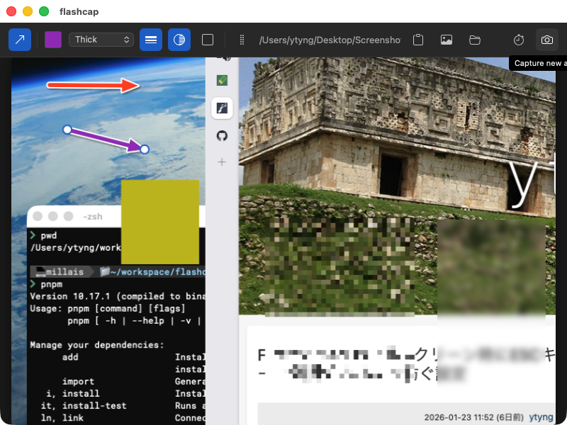

# FlashCap


A macOS screenshot capture & annotation app.



## Features

- Screenshot capture (interactive area selection)
- Timer capture (configurable delay: 3/5/10 seconds)
- Arrow annotation tool (color, thickness, white stroke, drop shadow)
- Mask tool (mosaic, blur, fill) with resize/move handles
- Clipboard integration (copy path or image)
- Drag & drop to external apps (e.g. Slack)
- Configurable save location (tmp / macOS default / custom folder)
- Keyboard shortcuts (ESC to quit, Delete to remove selected annotation)
- Preferences window (save location, timer delay)

## Tech Stack

- **Frontend**: SvelteKit 2, Svelte 5, TypeScript
- **Backend**: Rust (Tauri 2.x)
- **Build**: Vite, pnpm

## Prerequisites

- Rust (stable)
- Node.js
- pnpm
- macOS

## Development

```bash
pnpm install
pnpm tauri dev
```

## Build

```bash
pnpm tauri build
```

## Type Check

```bash
pnpm check
```

## Project Structure

```
src/                          # SvelteKit frontend
  routes/
    +page.svelte              # Main capture UI
    preferences/+page.svelte  # Preferences page
  lib/
    ArrowOverlay.svelte       # Arrow annotation overlay
    MaskOverlay.svelte        # Mask (mosaic/blur/fill) overlay
    types.ts                  # Shared types
src-tauri/                    # Rust backend (Tauri)
  src/lib.rs                  # Tauri commands & app setup
```

## Note for AI Assistants

SvelteKit 2 (with Svelte 5 runes) and Tauri 2.x are relatively new frameworks. When working on this project, use **context7 MCP** to look up the latest API documentation.
